# 🛡️ Sysmon & Splunk Monitoring Lab | Centralised Windows Security Monitoring

## Overview

This lab demonstrates how to deploy Splunk Enterprise on Ubuntu Desktop, install Sysmon on Windows Server 2025, and configure Splunk Universal Forwarder to forward Windows Event Logs and Sysmon telemetry to a centralised SIEM platform.

The objective was to build a security monitoring environment capable of collecting, centralising, and analysing endpoint activity from a Windows host.

This project demonstrates core SOC Analyst skills including:

* SIEM deployment
* Endpoint monitoring
* Log collection
* Event analysis
* Security monitoring
* Troubleshooting log ingestion issues

---

# Lab Architecture

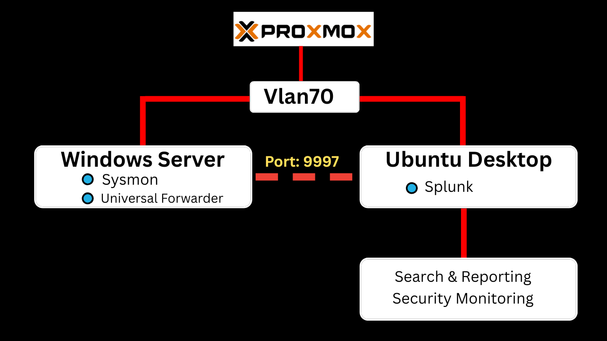

**Figure 1.** Lab topology showing Windows Server 2025 forwarding Windows Event Logs and Sysmon telemetry to Splunk Enterprise hosted on Ubuntu Desktop.

```text
+--------------------------------------------------+
|                  Proxmox VE                      |
+--------------------------------------------------+

                VLAN70

+--------------------+
| Windows Server     |
|                    |
| Sysmon             |
| Universal Forwarder|
+----------+---------+
           |
           | TCP 9997
           |
           v

+-------------------------+
| Ubuntu Desktop          |
| Splunk Enterprise       |
| Index: wineventlog      |
+------------+------------+
             |
             v

+-------------------------+
| Search & Reporting      |
| Security Monitoring     |
+-------------------------+
```

---

# Lab Objectives

* Deploy Splunk Enterprise on Ubuntu
* Configure Splunk as a receiving indexer
* Install Sysmon on Windows Server
* Install Splunk Universal Forwarder
* Forward Windows Event Logs
* Forward Sysmon Operational Logs
* Create a dedicated Splunk index
* Validate event ingestion
* Monitor endpoint activity

---

# Environment

| Component                | IP Address  | Purpose                      |
| ------------------------ | ----------- | ---------------------------- |
| Ubuntu Desktop 24.04 LTS | 10.0.70.104 | Splunk Enterprise            |
| Windows Server 2025      | 10.0.70.x   | Sysmon + Universal Forwarder |
| Proxmox VE               | N/A         | Virtualisation Platform      |

---

# Phase 1 – Ubuntu Installation

## Download Ubuntu

Official Website:

https://ubuntu.com/download/desktop

Version Used:

```text
Ubuntu Desktop 24.04 LTS
```

---

## Create VM in Proxmox

Configuration:

```text
CPU: 2 vCPU
RAM: 8 GB
Disk: 80 GB
Network: VLAN70
```

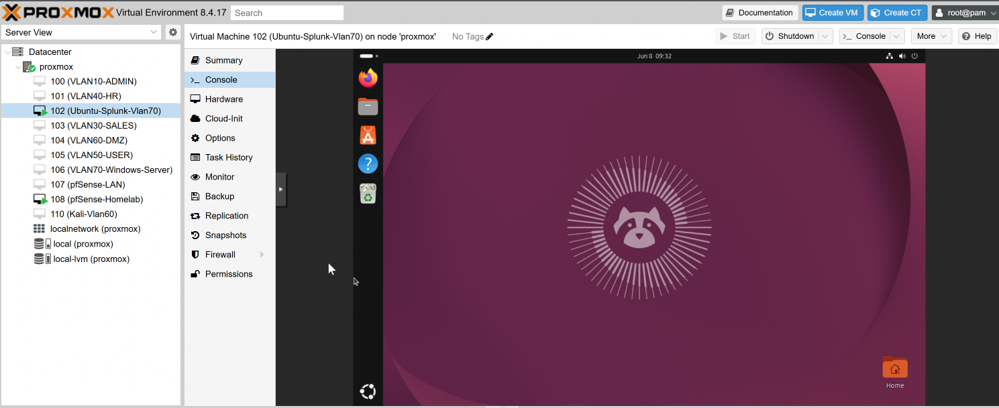

**Figure 2.** Ubuntu Desktop virtual machine configuration deployed within Proxmox.

---

## Install Ubuntu

Selected:

```text
✓ Install third-party software for graphics and Wi-Fi hardware

✓ Download and install support for additional media formats
```

---

## Update Ubuntu

```bash
sudo apt update
sudo apt upgrade -y
```

---

# Phase 2 – Splunk Enterprise Installation

## Download Splunk Enterprise

Downloaded the Linux `.tgz` package from Splunk.

Example:

```text
splunk-10.4.0-<build>-Linux-x86_64.tgz
```

---

## Extract Splunk

Navigate to Downloads:

```bash
cd ~/Downloads
```

Extract archive:

```bash
tar -xvzf splunk-10.4.0-*.tgz
```

Verify extraction:

```bash
ls
```

Expected:

```text
splunk
```

---

## Move Splunk to /opt

```bash
sudo mv splunk /opt/
```

Verify:

```bash
ls /opt
```

Expected:

```text
splunk
```

---

## Verify Installation Files

```bash
ls /opt/splunk/bin
```

Expected:

```text
splunk
splunkd
```

---

# Phase 3 – First Startup

Start Splunk:

```bash
sudo /opt/splunk/bin/splunk start --accept-license --run-as-root
```

Accept the licence agreement and create the administrator account.

---

## Enable Startup

```bash
sudo /opt/splunk/bin/splunk enable boot-start
```

---

## Verify Splunk Status

```bash
sudo /opt/splunk/bin/splunk status
```

Expected:

```text
splunkd is running
```

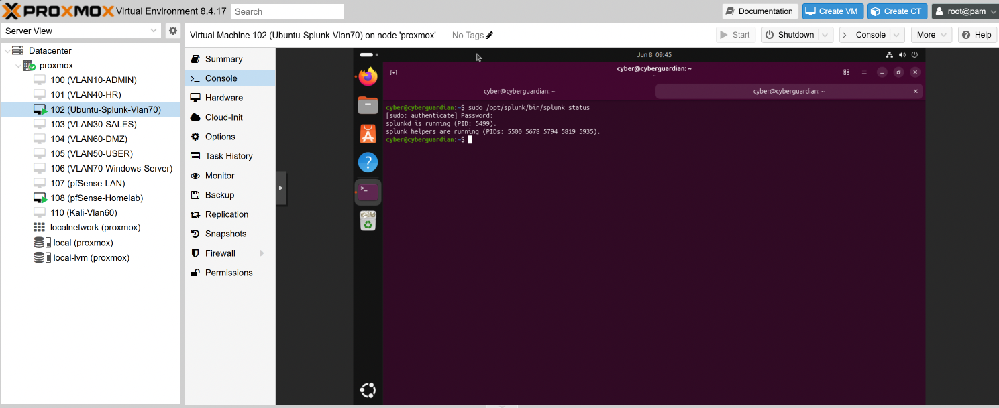

**Figure 3.** Verification showing Splunk services successfully running on Ubuntu.

---

# Phase 4 – Access Splunk Web

Open:

```text
http://10.0.70.104:8000
```

or

```text
http://cyber:8000
```

Login using the administrator credentials created during installation.

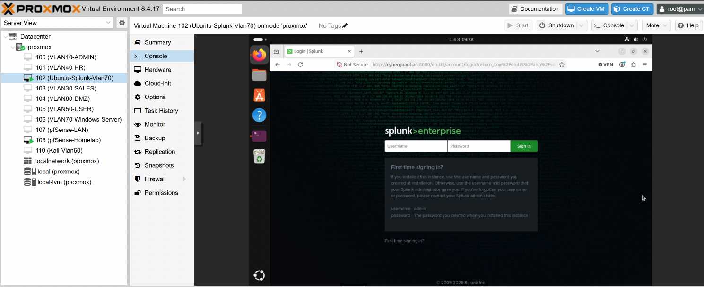

**Figure 4.** Splunk Enterprise web interface accessible from the browser.

---

# Phase 5 – Configure Splunk Receiver

Navigate:

```text
Settings
→ Forwarding and Receiving
→ Configure Receiving
→ New Receiving Port
```

Port:

```text
9997
```

Save configuration.

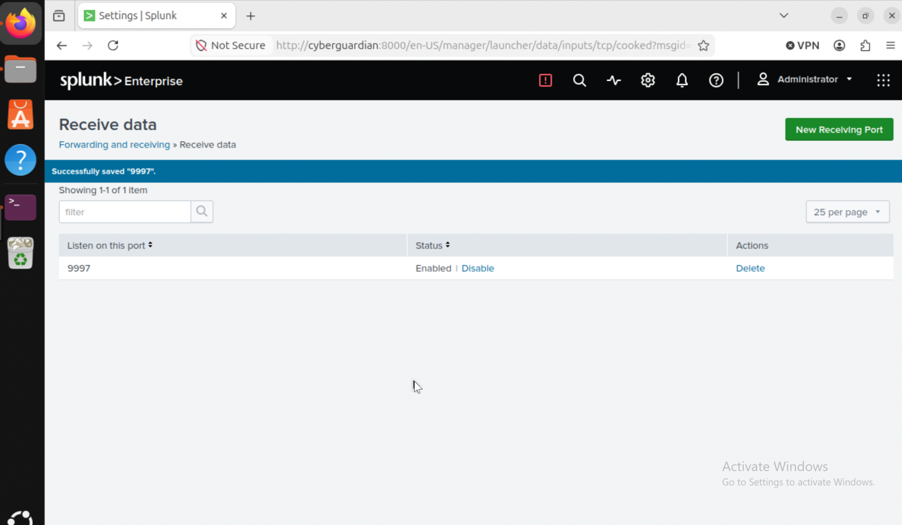

**Figure 5.** Splunk configured to receive forwarded events on TCP port 9997.

---

## Verify Receiver

Ubuntu:

```bash
sudo ss -tulpn | grep 9997
```

Expected:

```text
LISTEN *:9997
```

---

# Phase 6 – Install Sysmon

## Download Sysmon

Downloaded Sysmon from Microsoft Sysinternals.

https://learn.microsoft.com/en-us/sysinternals/downloads/sysmon

---

## Extract Files

Created:

```text
C:\Tools\Sysmon
```

Extracted Sysmon files into the folder.

---

## Install Sysmon

Open Command Prompt as Administrator:

```cmd
cd C:\Tools\Sysmon

sysmon64.exe -accepteula -i
```

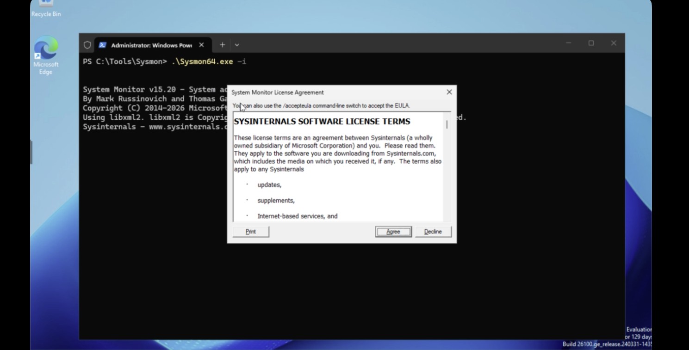

**Figure 6.** Successful Sysmon installation on Windows Server 2025.

---

## Verify Sysmon

Open:

```text
Event Viewer
```

Navigate:

```text
Applications and Services Logs
→ Microsoft
→ Windows
→ Sysmon
→ Operational
```

Generate activity:

```cmd
notepad.exe
```

Verify events appear.

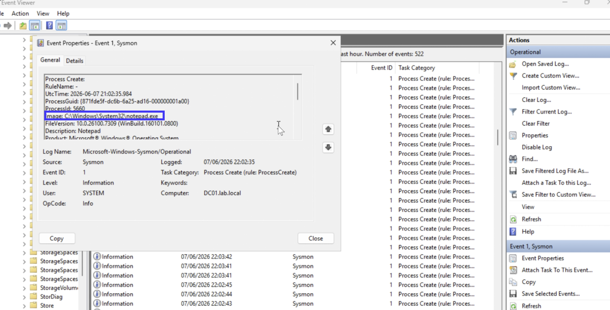

**Figure 7.** Sysmon Operational log displaying endpoint telemetry generated by the Windows host.

---

# Phase 7 – Install Splunk Universal Forwarder

Download:

https://www.splunk.com/en_us/download/universal-forwarder.html

Install on Windows Server.

---

## Universal Forwarder Configuration

Installation Type:

```text
On-Premises Splunk Enterprise Instance
```

Service Account:

```text
Local System
```

Receiving Indexer:

```text
10.0.70.104
```

Receiving Port:

```text
9997
```

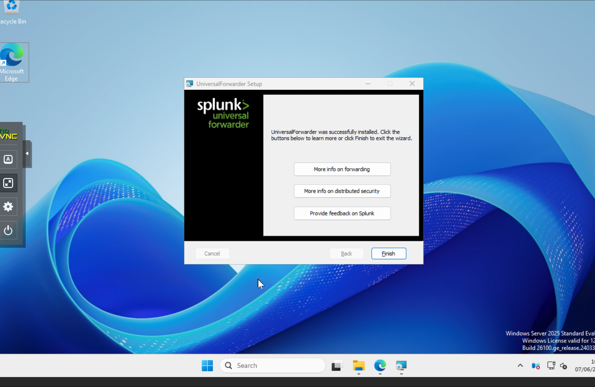

**Figure 8.** Splunk Universal Forwarder installation and initial configuration.

---

## Verify Forwarding

PowerShell:

```powershell
& "C:\Program Files\SplunkUniversalForwarder\bin\splunk.exe" list forward-server
```

Expected:

```text
Active forwards:
10.0.70.104:9997
```

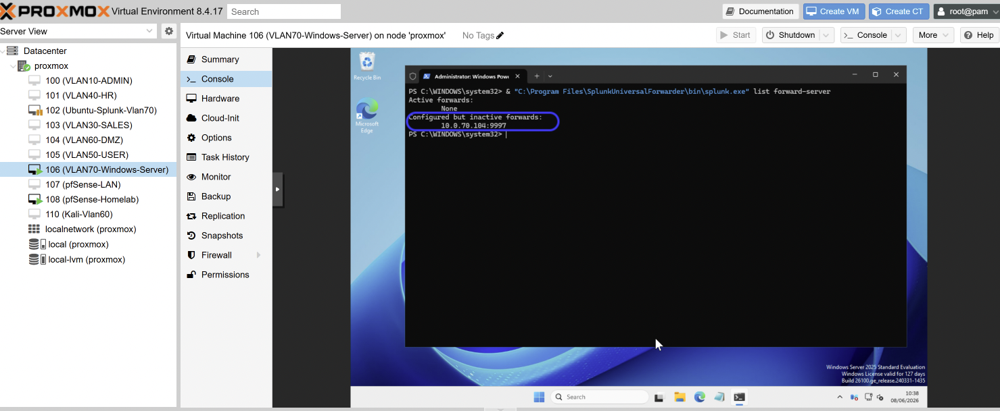

**Figure 9.** Universal Forwarder successfully configured to send logs to Splunk Enterprise.

---

# Phase 8 – Configure Log Collection

Create:

```text
C:\Program Files\SplunkUniversalForwarder\etc\system\local\inputs.conf
```

Contents:

```ini
[WinEventLog://Security]
disabled = 0
index = wineventlog

[WinEventLog://System]
disabled = 0
index = wineventlog

[WinEventLog://Application]
disabled = 0
index = wineventlog

[WinEventLog://Microsoft-Windows-Sysmon/Operational]
disabled = 0
index = wineventlog
```


**Figure 10.** Configuration used to collect Windows Event Logs and Sysmon telemetry.

---

## Restart Forwarder

```cmd
net stop splunkforwarder

net start splunkforwarder
```

---

## Verify Inputs

```powershell
& "C:\Program Files\SplunkUniversalForwarder\bin\splunk.exe" btool inputs list --debug | findstr WinEventLog
```

Expected:

```text
[WinEventLog://Security]
[WinEventLog://System]
[WinEventLog://Application]
[WinEventLog://Microsoft-Windows-Sysmon/Operational]
```

---

# Phase 9 – Create Splunk Index

Navigate:

```text
Settings
→ Indexes
→ New Index
```

Create:

```text
wineventlog
```

Save.


**Figure 11.** Dedicated Splunk index created for Windows Event Logs and Sysmon data.

---

# Troubleshooting Notes

## Issue 1 – Splunk Required Root Privileges

Error:

```text
Use the --run-as-root option
```

Resolution:

```bash
sudo /opt/splunk/bin/splunk start --accept-license --run-as-root
```

---

## Issue 2 – inputs.conf Not Loading

Issue:

```text
inputs.conf.txt
```

instead of:

```text
inputs.conf
```

Resolution:

Enabled Windows file extensions and renamed the file correctly.

---

## Issue 3 – Events Not Appearing in Splunk

Splunk Notification:

```text
Received event for unconfigured/deleted index=wineventlog
Dropping them
```

Cause:

```text
wineventlog index did not exist
```

Resolution:

Created the wineventlog index.

---

# Phase 10 – Verify Event Ingestion

Search:

```spl
index=wineventlog
```

Successfully observed:

* Security Events
* System Events
* Application Events
* Sysmon Events

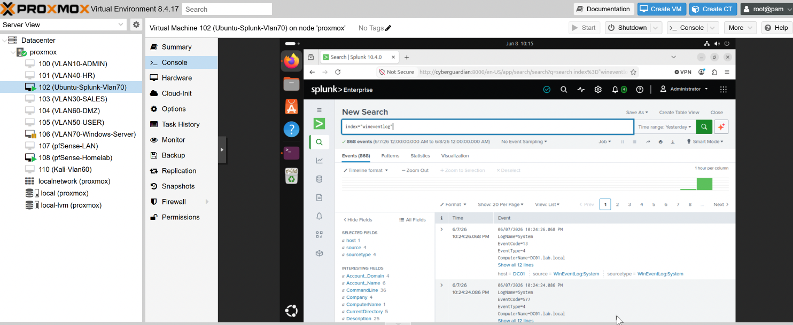

**Figure 12.** Windows Event Logs and Sysmon telemetry successfully ingested into the wineventlog index.

---

# Phase 11 – Detection Validation

## Process Creation Monitoring

Generate activity:

```cmd
notepad.exe
```

Search:

```spl
index=wineventlog EventCode=1
```

Expected:

```text
Sysmon Event ID 1
Process Creation
```

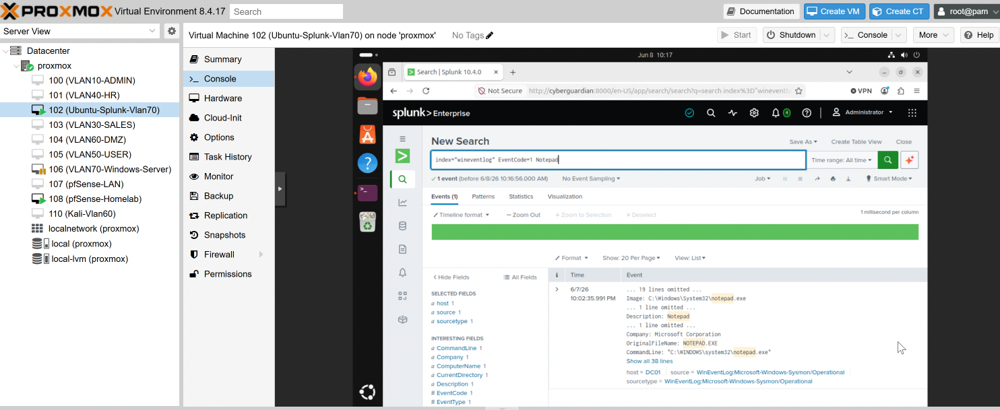

**Figure 13.** Sysmon Event ID 1 displaying process creation activity detected within Splunk.

---

## DNS Query Monitoring

Generate activity:

```cmd
nslookup google.com
```

Search:

```spl
index=wineventlog EventCode=22
```

Expected:

```text
DNS Query Events
```


**Figure 14.** Sysmon Event ID 22 displaying DNS query activity collected and searchable within Splunk.

---

# Useful Splunk Searches

## All Sysmon Events

```spl
index=wineventlog sourcetype="XmlWinEventLog:Microsoft-Windows-Sysmon/Operational"
```

## Process Creation Events

```spl
index=wineventlog EventCode=1
```

## Network Connections

```spl
index=wineventlog EventCode=3
```

## DNS Queries

```spl
index=wineventlog EventCode=22
```

## PowerShell Activity

```spl
index=wineventlog EventCode=1 Image="*powershell.exe"
```

---

# Skills Demonstrated

* Ubuntu Administration
* Splunk Enterprise Deployment
* Splunk Administration
* Splunk Receiver Configuration
* Splunk Universal Forwarder
* Windows Event Collection
* Sysmon Deployment
* Endpoint Monitoring
* Log Ingestion Troubleshooting
* Security Event Analysis
* SIEM Operations
* Detection Engineering Fundamentals
* SOC Analyst Skills

---

# Outcome

Successfully deployed a centralised logging and monitoring environment using Splunk Enterprise, Sysmon, and Splunk Universal Forwarder.

Windows Event Logs and Sysmon telemetry were collected, forwarded, indexed, and analysed through Splunk Search & Reporting.

This project provides a foundation for future threat detection, threat hunting, and SOC investigation labs.
